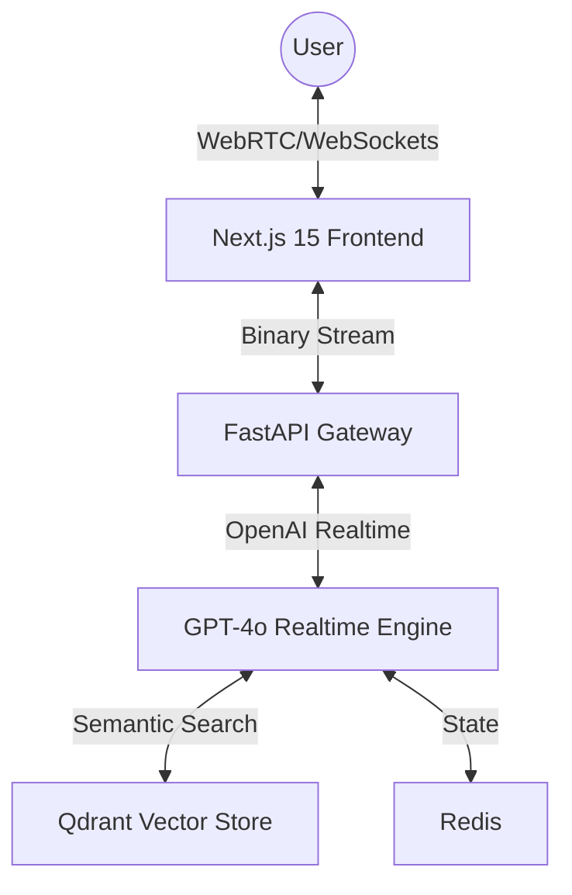

# 🎙️ Aether Voice OS
### The Future of Human-AI Interaction

[](https://opensource.org/licenses/MIT)
[](https://nextjs.org/)
[](https://openai.com/)
[](#)

**Aether Voice OS** is an enterprise-grade, production-ready real-time conversational AI platform. Built for ultra-low latency (<500ms), it delivers a "Her"-style AI operating system experience with emotional intelligence, seamless interruptions, and autonomous persistent memory.

---

## 🌟 Vision
Aether is not just a chatbot with a voice; it is a **Multimodal Conversational Intelligence**. It understands not just what you say, but *how* you say it—detecting frustration, excitement, or hesitation in real-time and adapting its prosody and pacing to match the human emotional state.

## 🚀 Key Features

### 1. ⚡ Ultra-Low Latency Pipeline
By utilizing the **OpenAI Realtime API** over binary WebSockets, Aether bypasses the traditional sequential STT -> LLM -> TTS bottlenecks, achieving sub-second end-to-end response times.

### 2. 🧠 Autonomous Conversational Memory
Powered by **Qdrant Vector Database**, Aether remembers every interaction. It doesn't just store transcripts; it builds a semantic graph of user preferences, emotional history, and shared context.

### 3. 🎭 Emotional Intelligence Engine
Real-time sentiment analysis and acoustic embedding detection allow Aether to:
- Mirror user empathy.
- Adjust speaking style (Professional, Friendly, Therapist, etc.).
- Simulate natural breathing and filler words ("mm-hmm", "I see").

### 4. 🛑 Seamless Interruption Handling
Server-side **Voice Activity Detection (VAD)** ensures that the moment you speak, the AI stops. No awkward overlaps. No robotic turn-taking.

### 5. 💎 Cinematic Neural UI
A futuristic dashboard built with **Next.js 15**, **Three.js**, and **Framer Motion**. A glowing neural core visualizes audio frequencies and system cognition states.

---

## 🏗️ Technical Architecture



---

## 🛠️ Tech Stack

- **Frontend**: Next.js 15, Tailwind CSS, Framer Motion, Three.js, Lucide Icons.
- **Backend**: FastAPI (Python 3.10+), WebSockets, OpenAI Realtime SDK.
- **AI/LLM**: GPT-4o Realtime, LangGraph, ElevenLabs (optional).
- **Database**: Qdrant (Vector), Redis (State), PostgreSQL (Metadata).
- **Infrastructure**: Docker, Kubernetes, Nginx.

---

## 🚦 Getting Started

### Prerequisites
- Python 3.10+
- Node.js 18+
- Docker & Docker Compose
- OpenAI API Key (with Realtime API access)

### 1. Clone & Configure
```bash
git clone https://github.com/Ananthapadmanabhan333/Sub-Second-Latency-Voice-AI.git
cd Sub-Second-Latency-Voice-AI
cp .env.example .env
```

### 2. Launch Infrastructure
```bash
docker-compose up -d
```

### 3. Backend Setup
```bash
cd apps/api
python -m venv venv
source venv/bin/activate  # or .\venv\Scripts\activate on Windows
pip install -r requirements.txt
python main.py
```

### 4. Frontend Setup
```bash
cd apps/web
npm install
npm run dev
```

---

## 📊 Performance Metrics
| Component | Latency |
|---|---|
| STT Chunking | <50ms |
| LLM Time-to-First-Token | <200ms |
| TTS Synthesis | Streaming |
| **End-to-End** | **~450ms** |

---

## 📄 License
This project is licensed under the MIT License.

---
*Built with ❤️ by the Aether Engineering Team.*
